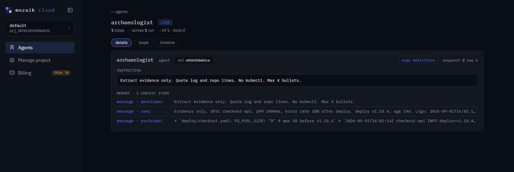
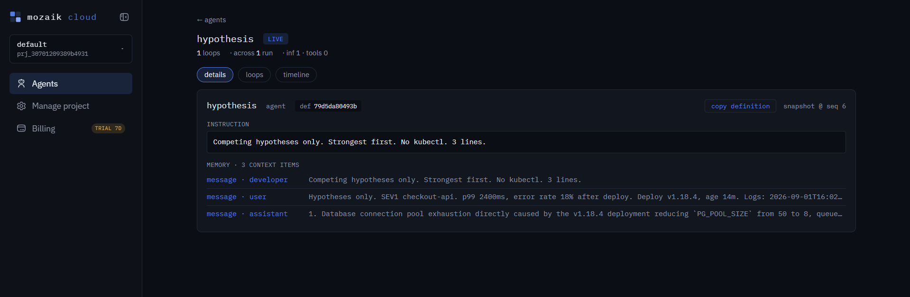
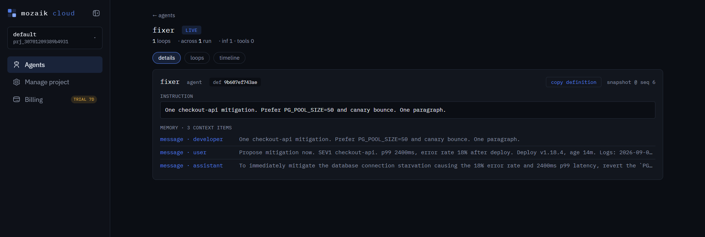

# PULSE

**The dangerous command dies before it finishes being written.**

PULSE is an incident command room. `checkout-api` is in SEV1 after a deploy. Archaeologist, Hypothesis and Fixer start work on that incident at the same time. RedTeam can veto a dangerous mitigation so the room has to change course. You are Commander: join, send one directive, leave.

Not a chatbot. Not a queue. The product is the overlap and the veto.

Built for **JigJoy × daily.dev × Hyperskill — Build Systems of Concurrent Agents**.

## Contents

1. [Run it (no API key)](#run-it-no-api-key)
2. [The problem](#the-problem)
3. [How it is wired](#how-it-is-wired)
4. [Roster](#roster)
5. [The veto](#the-veto)
6. [Why this is not a chatbot](#why-this-is-not-a-chatbot)
7. [Proof of concurrency](#proof-of-concurrency)
8. [Mozaik cloud](#mozaik-cloud)
9. [Wall](#wall)
10. [Live (optional)](#live-optional)
11. [Layout](#layout)

---

## Run it (no API key)

```bash
npm install
npm run replay
```

Open http://localhost:8787 and watch.

| Time | What happens |
| --- | --- |
| 0s | Sentry declares `checkout-api`. Triage sets SEV1 |
| ~2s | Archaeologist and Hypothesis emit on the same clock |
| ~4s | Fixer drafts `kubectl delete pod checkout-api --all` |
| same run | RedTeam strikes only that span |
| after | Safer path: restore `PG_POOL_SIZE=50`, bounce a canary |
| any time | Commander Join / Send / Leave. `do not delete` pulls the same veto gate |

**R** restart · **K** Kill-cam (window around the veto) · `npm test` detector.

Replay is the complete visual demo. Live Mozaik is `src/mozaik-live.ts` plus Mozaik cloud when paired.

---

## The problem

Incidents are not pipelines. At 3am one person reads logs, one argues the deploy, one types `kubectl`, one says do not run that in prod.

Most multi-agent demos still go search → analyze → propose → review. The review starts after the command exists.

PULSE keeps investigation, a guess, a fix, and a safety check on one clock.

---

## How it is wired

```
Sentry / Triage declare SEV1
              |
      shared bus + t_ms
        /     |      \
Archaeologist Hyp    Fixer
  evidence   causes  draft     (live: three runLoops, same incident)
                      |
                 findVeto
                /         \
             safe      VetoIssued → FixPivoted → safer draft

Commander is on the same bus
(live: the commander message is what starts the three loops)
```

Archaeologist and Hypothesis **overlap** Fixer. They do not have to finish before the draft starts. The UI only renders bus events.

---

## Roster

| Name | Role | Live model loop? |
| --- | --- | --- |
| Sentry | Alarm + raw lines | No — `IncidentDeclared` |
| Triage | SEV1 + reason | No — `SeveritySet` |
| Archaeologist | Evidence | Yes — `runLoop` |
| Hypothesis | Causes | Yes — `runLoop` |
| Fixer | Draft | Yes — `runLoop` |
| RedTeam | Veto | Same runtime; `findVeto` on Fixer text |
| Facts / Comms | Right rail | Observer |
| Commander | Human bar | `createHuman` — not an LLM |

Six panels are not six paid models.

---

## The veto

Fixer drafts `kubectl delete pod checkout-api --all`. `src/veto.ts` marks **that span**, not the whole paragraph.

```
FixDraftFinal → findVeto() → VetoIssued → FixPivoted → safer draft
```

On **replay**, the strike happens while the line is still being written. On **live**, Fixer streaming is off in this repo; `findVeto` runs on the text that arrives. Live Gemini often writes the safe pool restore, so there may be no red span — that is the detector, not a miss.

Commander can pull the same gate without a model. After a dangerous draft exists, send `do not delete` / `hold the kubectl` / `veto`. `page payments on-call too` is logged only.

---

## Why this is not a chatbot

| Pipeline | PULSE |
| --- | --- |
| Each stage waits | Three loops start on one SEV1 |
| Reviewer sees a finished command | RedTeam can change the outcome |
| Canned status | Facts = landed events only |
| Human is a prompt | Commander joins, logs an order, can halt a delete |
| Overlap is animation | Swimlane from `t_ms` |

---

## Proof of concurrency

`src/mozaik-live.ts` — grep `runLoop`.

```
infer("archaeologist", ...)
infer("hypothesis", ...)
infer("fixer", ...)
```

No wait between those calls. Each emits `LoopStarted` with `t_ms`.

---

## Mozaik cloud

This is the runtime evidence, not a mock. After `npx @mozaik-ai/cloud-sdk pair` and `npm run live`, [Mozaik cloud](https://app.jigjoy.ai/) shows three agents on **one SEV1**: archaeologist, hypothesis, fixer. Each has **1 loop**. Memory holds the same checkout incident (p99, deploy `v1.18.4`) plus that agent's own answer.

That is concurrent work: three `runLoop`s, not a queue of screenshots.

### Archaeologist



### Hypothesis



### Fixer



Pair is telemetry. A model key is still required for tokens. RedTeam is on the runtime and does not need its own loop unless a pivot runs.

---

## Wall

**Header** — service, SEV1, error %, p99, deploy age, clock.

**Ticks** — a name lights when that participant emits.

**Panels** — Sentry, Triage, Archaeologist, Hypothesis, Fixer, RedTeam.

**Facts** — far right. Landed events only.

**Overlap** — bars from timestamps.

**Commander** — bottom. Status on the right is the last bus event.

---

## Live (optional)

Replay needs no model. Live uses whichever **allowlisted** provider you have credit for.

| Provider | Env var | Example `PULSE_MODEL_FAST` |
| --- | --- | --- |
| Google | `GEMINI_API_KEY` | `gemini-3.5-flash` |
| OpenAI | `OPENAI_API_KEY` | `gpt-5.5` |
| Anthropic | `ANTHROPIC_API_KEY` | `claude-haiku-4-5` |
| DeepSeek | `OPENAI_API_KEY` + compatible base URL | `deepseek-v4-flash` |

```powershell
npm run live
```

`.env` next to `package.json`, never committed. Groq / Llama / `gpt-4.1-mini` are rejected before HTTP. Ignore pairing vs model keys: pair = cloud telemetry; `GEMINI_API_KEY` = tokens. Node 22+.

---

## Layout

`src/mozaik-live.ts` · `src/replay.ts` · `src/veto.ts` · `src/load-env.ts` · `ui/` · `assets/`
